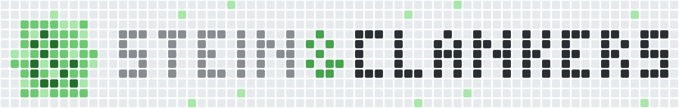

# steinclankers

Live: https://markussteinbrecher.github.io/steinclankers/

Home page of Stein&Clankers, the umbrella over all our projects. It is Clanker City, a small isometric 3D city ringed by grass, mountains and a lake. Every project has a building of its own (a radio station for rrradio, an academy for meinHERMES, a bistro for rrrecipe…), sized by its lifetime commits, with its logo on the roof and its real 12-week commit graph as contribution-graph cells in the plaza in front; the HQ carries the Stein&Clankers wordmark in 3D letters. Robots carry commits to the buildings while cars, clankers, birds, a blimp, balloons and drones keep the city busy. Paused projects have grey signs and a sleeping robot. The Clanker Café in the HQ plaza links to rrradio's Ko-fi page. There is also a plain list view at `#list`.

## Run

```
npm install
npm run dev        # http://localhost:5173
npm run build      # static site in dist/
```

## Update the projects

1. Edit `projects.config.json`. It decides what is public: only listed projects appear, and `lab` repos are summed into one anonymous station.
2. Run `npm run activity`. It reads commit **dates only** from the local repos under `~/Code` and writes `src/data/projects.json`. Private repos that should be counted but never named go in the gitignored `projects.private.json` (`{"repos": {"<station id>": ["<folder>"]}}`).
3. Commit both files. CI only builds; it cannot see the local repos.

## Pieces

| Path | What |
|---|---|
| `src/scene/city.js` | Renderer, camera, HQ, project stations, robots, interaction, loop |
| `src/scene/city/buildings.js` | One architecture per project (radio station, academy, bistro, …) |
| `src/scene/city/layout.js` | Street grid, cell classes, block plan, path finding |
| `src/scene/city/ground.js` | Grass, asphalt, block slabs, contribution-graph cells |
| `src/scene/city/furnish.js` | Towers, houses, parks, stadium, works, parking, lamps, street trees |
| `src/scene/city/scenery.js` | Instanced trees, mountains, lake, sailboat, forests |
| `src/scene/city/signs.js` | Project logo signs (colours per project) and the 3D wordmark cells |
| `src/scene/city/life.js`, `sky.js` | Traffic, crowd, blimp, balloons, drones, birds, smoke, fountain |
| `src/scene/robot.js` | The clanker: model, delivery/patrol/sleep behaviour |
| `src/scene/glyphs.js` | 7 x 7 station signs and the 11 x 11 mark |
| `src/main.js`, `src/ui/` | Panel, list view, routing (`#<project-id>`, `#list`), theme |
| `public/vendor/steinerdesign/` | SteinerDesign v1.1.0 (`dist/` + `assets/`, vendored) |
| `public/brand/` | Logo files from the stein-clankers-logo generator |

Deploys to GitHub Pages from `main` via `.github/workflows/deploy.yml`.
